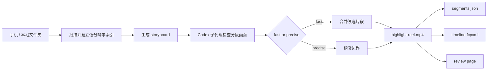

# PromptClip-Skill

Turn a folder of raw clips into one clean highlight reel with a single prompt.

PromptClip-Skill is a local-first, prompt-driven video highlight extractor. It keeps the source media untouched, builds a low-resolution frame index, lets Codex sub-agents inspect bounded timestamped batches, and exports one merged reel plus editable metadata.


### Public demo: keep the meaningful coffee moments


This is a real Skill run using two openly licensed Wikimedia Commons coffee videos. The Prompt keeps pouring, latte-art formation, and the finished drink, while filtering waiting, repeated takes, and shots with no visible change. The Skill scanned 32 samples, selected two candidate segments, and exported a 28-second highlight reel. Download the [full MP4 preview](examples/coffee/showcase/coffee-highlights.mp4), or inspect the source footage, Prompt, run manifest, and attribution records in [`examples/coffee`](examples/coffee/).

> Note: this is a real `fast`-mode run. Storyboard decisions were made by a visual Agent from sampled frames; review the timeline before treating the export as final. The run evidence is available in `examples/coffee/real-run/`.

Repository: https://github.com/ron0115/PromptClip-Skill

> If you also have a folder of videos you recorded but never have time to review, try the workflow and leave a Star if it is useful. Stars help me decide whether this direction is worth continuing.

## Is this for you?

Good fit: phone, action-camera, or DJI Nano-style clips from family life, travel, pets, or events where you want to keep the moments in which something meaningful actually happens.

Not a fit: users looking for a zero-setup hosted upload service, or a fully automatic editor with elaborate transitions and music.

The shortest path:

```text
1. Install or enable the Skill
2. Point it at a local video folder
3. Describe what to keep and what to filter out
4. Review the timestamp manifest, then export highlight-reel.mp4
```

The point is not to ask AI to produce a random montage. It is to make the most time-consuming first step reviewable: filter the throwaway footage first, then decide which moments belong in the final reel.

The repository is named `PromptClip-Skill`; `video-highlight-extractor` remains the stable Codex Skill and Python package name for compatibility.

## Why it is useful

- Describe the moment you want in plain language.
- Keep the source files private and unchanged.
- Review the result before export.
- Get one reel, one timeline, and one manifest instead of a pile of partial clips.
- It works like a waste-footage filter: drop long stretches with no signal, keep the moments worth watching.

## Representative demo

Think of the most common case: a phone folder full of messy footage and one simple request.

For example, short clips of a baby playing, a beach walk, or a weekend outing often contain a lot of throwaway footage. PromptClip-Skill is meant to filter that out first, then keep the moments that actually matter.

```text
Input
- /Users/ron0115/Documents/手机视频素材

Prompt
- 保留表情清晰、动作完整、适合直接分享的片段，过滤掉大量废片

Output
- highlight-reel.mp4
- segments.json
- run-report.json
- timeline.fcpxml
```

What the user sees:



For a privacy-safe showcase, use [`examples/skatepark`](examples/skatepark/): bring a set of appropriately licensed clips containing successful tricks, failed attempts, repeated takes, and empty shots, then use the Prompt to keep only completed actions. Third-party videos are intentionally not bundled in this repository; record each creator and license in `SOURCES.md`.

The repository also includes a downloaded, openly licensed coffee demo in [`examples/coffee`](examples/coffee/). It demonstrates keeping meaningful changes in a latte-making process while filtering waiting and repeated shots, with creator and license records in `SOURCES.md`. The original OGV is archived in `source-original/`; the Skill run uses a more broadly supported WebM copy.

## Codex Skill mode

Use `/video-highlight-extractor` in Codex and provide a local folder plus a natural-language Prompt. The workflow is not tied to any single niche: baby videos are only one example, and the same pipeline can handle travel, pets, sports, events, interviews, or any other subject described by the Prompt.

The default mode is `fast`: it stops after storyboard analysis and exports padded storyboard candidates with `--include-pending`. Use `precise` when the Prompt explicitly requires exact boundaries or frame-level compliance; it adds the refinement pass and exports accepted candidates only. Both modes share the same scan, storyboard, Agent result contract, and export implementation.

When a user supplies a source folder and does not choose a separate export location, user-facing results are written next to the source material under `PromptClip-Highlights/<run-id>/`. The internal scan cache can remain under `work/video-highlight/runs`, but the final `highlight-reel.mp4`, `segments.json`, `run-report.json`, and `timeline.fcpxml` stay easy to find from the original media folder.

## Export

The export stage chooses the best path for the selected timeline:

- `stream_copy`: source streams are compatible and every cut is keyframe-safe.
- `single_transcode`: source parameters fit, but a cut needs frame-accurate decoding.
- `compatibility_transcode`: source parameters differ or the normal concat path fails.

`segments.json` records `export_strategy`, `export_profile`, `target_audio_bitrate`, `target_audio_sample_rate`, `target_audio_channels`, `analysis_prompt`, `prompt_presets`, `source_preserved`, and `reencoded`. `highlight-reel.mp4` is the primary media artifact; `timeline.fcpxml` and the JSON manifest retain the source time ranges for editing applications.

## Quick start

### In Codex

```text
/video-highlight-extractor
```

Then point it at a local folder and a prompt.

### From the command line

```bash
python3 -m video_highlight process \
  --input "/Users/ron0115/Documents/手机视频素材" \
  --output work/runs \
  --prompt "保留表情清晰、动作完整、和家人互动的片段" \
  --provider mock \
  --export-output "/Users/ron0115/Documents/手机视频素材/PromptClip-Highlights/run-demo" \
  --export-profile platform \
  --include-pending \
  --limit 3
```

The `mock` provider is deterministic and exists only to validate the local pipeline in automated tests. It does not understand video content and should not be used for a user-facing result.

Start the review page for a run:

```bash
python3 -m video_highlight review --run work/runs/<run-id>
```

## Prompt presets

The analysis prompt includes this built-in preset before model evaluation:

- `leading-obstruction-trim`: avoid clips whose opening is visibly obstructed.

Disable a preset by setting `PROMPTCLIP_DISABLED_PROMPT_PRESETS` to a comma-separated list of preset IDs.

Presets are analysis-prompt additions only. They are evaluated by the visual Agent and do not add a local video scan, export-time frame extraction, or post-export timeline adjustment.

## Output structure

```text
PromptClip-Highlights/<run-id>/
  highlight-reel.mp4
  segments.json
  run-report.json
  timeline.fcpxml
```

## For contributors

- `fast` is the default for everyday highlight extraction.
- `precise` is for explicit exact-cut requirements.
- The source media is never rewritten.
- The review page lets you inspect and adjust segments before export.

## Notes

- The first scan creates `run.json` and `frames/` under the run directory.
- Re-running the same run reuses existing extracted frames when the expected sample set is present.
- Scanning and independent export work use at most two workers by default; lower or raise this with `--workers` when the machine and storage can support it.
