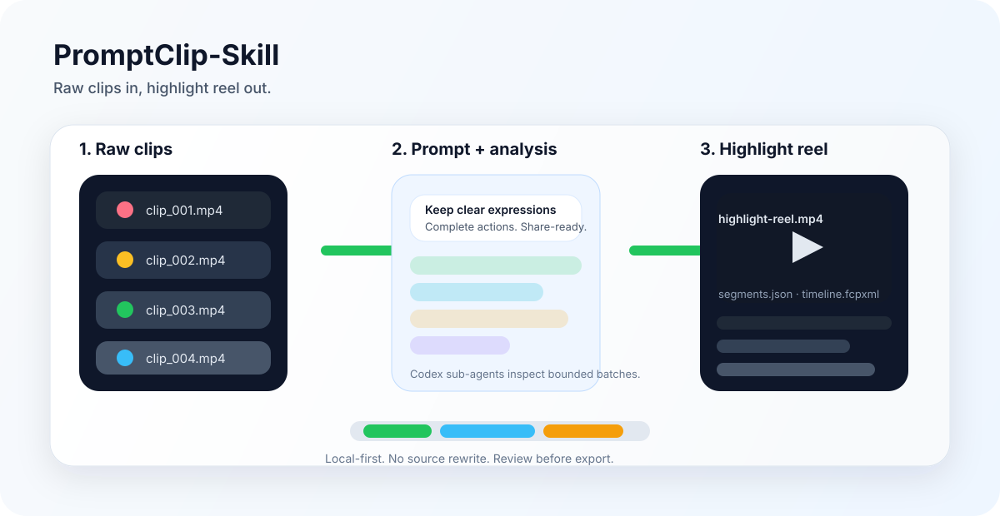
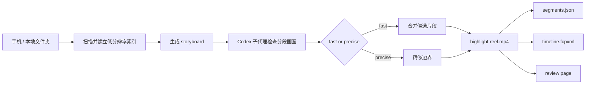

# PromptClip-Skill

用一句话，把一整个素材文件夹剪成一条高光视频。

PromptClip-Skill 是一个本地优先、Prompt 驱动的视频高光提取工具。它不会修改原始素材，会先建立低分辨率帧索引，再让 Codex 子代理检查带时间戳的分段画面，最后导出一条合并后的高光视频和可继续编辑的结构化产物。

[English README](README.en.md)



仓库地址：https://github.com/ron0115/PromptClip-Skill

仓库名是 `PromptClip-Skill`；`video-highlight-extractor` 是稳定的 Codex Skill 名称和 Python 包名，用于兼容已有流程。

## 它解决什么问题

很多视频素材的问题不是“不会剪”，而是“没时间看完”。PromptClip-Skill 试图把最费时间的第一步自动化：从一堆原始视频里找到符合要求的片段，并整理成可以复查、可以导出、可以继续进剪辑软件的结果。

它更像一个“废片过滤器”：先把大段没有信息量的片段筛掉，再把真正值得看的高光留下来。

- 用自然语言描述你想要的画面。
- 原始素材保留在本地，不被改写。
- 导出前可以打开本地 review 页面复查。
- 一次输出高光视频、时间线和 JSON 清单。

## 代表性 demo

最适合展示的场景：手机里有一堆杂乱素材，只想快速挑出适合分享的片段。

比如随手拍宝宝动态、海边遛娃、周末出门这些生活碎片，里面往往有大量时长其实是废片。
PromptClip-Skill 做的事情，就是先过滤掉这些废片，再把真正值得留下的瞬间整理出来。

```text
输入
- /Users/ron0115/Documents/手机视频素材

Prompt
- 保留表情清晰、动作完整、适合直接分享的片段，过滤掉大量废片

输出
- highlight-reel.mp4
- segments.json
- run-report.json
- timeline.fcpxml
```

流程图：



## Codex Skill 用法

在 Codex 里使用：

```text
/video-highlight-extractor
```

然后提供一个本地视频文件夹和你的筛选要求。它不绑定某个固定题材：宝宝、旅行、宠物、运动、活动、采访、课程片段都可以，只要你能用 Prompt 描述想保留什么。

默认模式是 `fast`：只做 storyboard 语义分析，直接导出带 padding 的候选片段，适合快速得到一个可看的结果。  
当 Prompt 明确要求“精剪、精准边界、逐帧、每一帧必须满足”时，使用 `precise`：它会在候选片段上追加精修判断，只导出被接受的片段。

如果用户没有指定导出目录，结果会默认写到原素材目录旁边：

```text
PromptClip-Highlights/<run-id>/
```

内部扫描缓存可以放在 `work/video-highlight/runs`，但用户真正需要的 `highlight-reel.mp4`、`segments.json`、`run-report.json` 和 `timeline.fcpxml` 会留在容易找到的位置。

## 命令行快速体验

```bash
python3 -m video_highlight process \
  --input "/Users/ron0115/Documents/手机视频素材" \
  --output work/runs \
  --prompt "保留表情清晰、动作完整、和家人互动的片段" \
  --provider mock \
  --export-output "/Users/ron0115/Documents/手机视频素材/PromptClip-Highlights/run-demo" \
  --export-profile platform \
  --include-pending \
  --limit 3
```

`mock` provider 是用于自动化测试的确定性实现，不理解真实视频内容，不建议用于面向用户的结果。

启动本地 review 页面：

```bash
python3 -m video_highlight review --run work/runs/<run-id>
```

## 输出产物

```text
PromptClip-Highlights/<run-id>/
  highlight-reel.mp4   # 合并后的高光视频
  segments.json        # 片段来源、时间戳、导出策略
  run-report.json      # 本次运行报告
  timeline.fcpxml      # 可导入剪辑软件的时间线
```

## Smart Export

导出阶段会根据素材和切点自动选择策略：

- `stream_copy`：素材流参数兼容，切点也在关键帧上，尽量保留原始视频/音频流。
- `single_transcode`：素材参数兼容，但切点需要帧级解码，只对最终时间线做一次转码。
- `compatibility_transcode`：素材参数不一致或普通拼接失败时，归一化为更通用的 H.264/AAC MP4。

`segments.json` 会记录 `export_strategy`、`export_profile`、`target_audio_bitrate`、`target_audio_sample_rate`、`target_audio_channels`、`analysis_prompt`、`prompt_presets`、`source_preserved` 和 `reencoded`，方便复查和二次处理。

## Prompt Presets

当前内置的分析提示增强：

- `leading-obstruction-trim`：提示模型避开开头明显被遮挡的片段。

可以通过环境变量关闭：

```bash
export PROMPTCLIP_DISABLED_PROMPT_PRESETS=leading-obstruction-trim
```

Preset 只影响分析 Prompt，不会额外扫描视频，也不会改变导出阶段的 Smart Export 策略。

## 适合贡献的方向

- 更好的 storyboard 采样策略
- 更强的本地质量预筛选
- 更多垂直场景 Prompt preset
- 更好看的 review 页面
- 更完整的导出格式支持
- 针对中文视频素材的评测样例

## 开发说明

- `fast` 是日常高光提取的默认模式。
- `precise` 用于明确要求精准切点的任务。
- 原始素材不会被改写。
- 第一次扫描会在 run 目录下创建 `run.json` 和 `frames/`。
- 相同素材重新运行时会复用已提取的帧。
- 扫描和导出默认最多使用两个 worker，可通过 `--workers` 调整。
