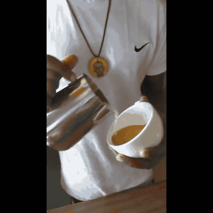

# Public Demo: Coffee Highlights

This demo uses openly licensed footage downloaded from Wikimedia Commons. It is designed to show semantic filtering without using private family videos or identifiable personal recordings.

## Showcase



The [full MP4](showcase/coffee-highlights.mp4) is a short, manually selected reference edit assembled from the two source videos. It is included to make the result easy to understand on GitHub; it is not presented as an AI-generated output. The individual source clips are also kept in `showcase/` so the construction is inspectable.

## Files

- `input/latte-art-leaf-01.ogv` - CC0 latte-art footage
- `input/making-cappuccino-coffee.webm` - CC BY-SA 4.0 coffee-making footage
- [`prompt.txt`](prompt.txt) - reusable filtering Prompt
- [`SOURCES.md`](SOURCES.md) - attribution and license records
- [`showcase/coffee-highlights.mp4`](showcase/coffee-highlights.mp4) - short reference edit

## Prompt

```text
Keep the meaningful coffee-making moments: coffee or milk being poured,
the latte pattern forming, the finished drink, and stable close-ups of
the completed result. Remove waiting, preparation with no visible change,
repeated takes, severe camera shake, blocked views, and empty shots.
Preserve the original order and keep the final reel under 30 seconds.
```

This is a small showcase dataset, not a benchmark. The selected moments should be reviewed before being described as a final edit, especially when using the `fast` mode.
